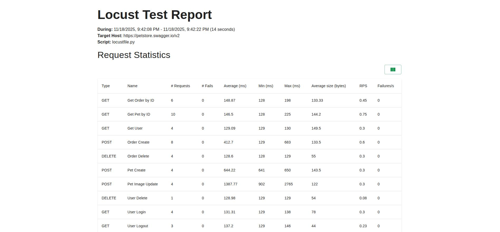

# PetStore Load Tests

Load test suite for [PetStore API](https://petstore.swagger.io) - a REST API for pet store testing scenarios.

## Quick Start

```bash
# Install dependencies
make install

# Run load tests (without reports)
make test

# Run load tests with HTML and CSV reports
make test-html
```

## Tech Stack

**Core packages:**
- `locust` - load testing framework
- `requests` - HTTP client
- `faker` - test data generation
- `uv` - Python package manager

## Project Structure

### Data Layer (`data/`)
Test data generation and management:
- `pet.py` - pet data generation with categories and tags
- `user.py` - user data generation
- `order.py` - order data generation
- `test_data.py` - base test data utilities

### Utils Modules (`utils/`)
- `logger.py` - custom logger for HTTP requests/responses (saves to files with timestamps)
- `generator.py` - test data generation utilities

### Tests (`tests/`)
- `test_pet.py` - pet CRUD operations load tests
- `test_user.py` - user management load tests
- `test_order.py` - order processing load tests

## Implementation Details

### Locust Task-based Load Testing
Uses Locust framework with HttpUser, TaskSet, and SequentialTaskSet:
- **HttpUser** - simulates concurrent users
- **TaskSet** - groups related tasks
- **SequentialTaskSet** - executes tasks in sequence (e.g., Create -> Update -> Get -> Delete)
- **@task** decorator - defines task execution frequency and order

### Request/Response Logging
- **File logging**: detailed HTTP requests/responses in `logs/log_*.log` for debugging
- Each log entry includes:
  - Task name and timestamp
  - Request method, URL, and body
  - Response code, text, headers, and cookies
  - Task execution result

Logging is integrated at the task level - all HTTP requests are automatically logged via `Logger` utility.

### Data-driven Approach
Test data is generated dynamically using Faker and custom data generators. Pet IDs are generated using timestamps to ensure uniqueness.

### Load Test Configuration
Configuration is managed via `config.yml`:
- `locustfile` - path to test files directory
- `users` - number of concurrent users
- `spawn-rate` - user spawn rate per second
- `headless` - run in headless mode (no web UI)
- `run-time` - test duration

## Docker

Project is containerized for consistent test execution:

```bash
# Build image
make docker-build

# Run load tests in Docker (logs only, no HTML/CSV reports)
make docker-test

# Run load tests in Docker with HTML and CSV reports (saved to ./reports)
make docker-test-html

# Open shell in container
make docker-shell

# Clean up Docker resources
make docker-clean
```

Dockerfile uses Python 3.11 slim image and uv for fast dependency installation.

## Reports and Logs

**File Logs** (`logs/log_*.log`) are always created when running tests, regardless of the command used:
- Complete HTTP interaction information
- Timestamp for each request
- Request method, URL, headers, and body
- Response code, text, headers, and cookies
- Task execution results

**HTML and CSV Reports** are generated only when using `make test-html` or `make docker-test-html`. The basic `make test` and `make docker-test` commands run tests without creating HTML/CSV report files. The `docker-test-html` command mounts `./reports` to `/app/reports` to persist reports on the host.

**HTML Reports** (`reports/report.html`):
- Comprehensive test execution summary
- Statistics for each endpoint (request count, failures, response times)
- Response time percentiles (50th, 66th, 75th, 80th, 90th, 95th, 98th, 99th, 99.9th, 99.99th, 100th)
- Request rate (requests per second)
- Failure rate and error details
- User count and spawn rate over time
- Charts and graphs for visualization

**CSV Reports** (`reports/stats*.csv`):
- `stats_stats.csv` - detailed statistics for each endpoint
- `stats_failures.csv` - list of failed requests
- `stats_exceptions.csv` - exceptions that occurred during test execution

The `logs/` folder is automatically created for all test commands. The `reports/` folder is only created when running tests with report generation (`make test-html` or `make docker-test-html`).

## Test Execution Examples

### HTML Report Example

Generated HTML report (`reports/report.html`) provides a comprehensive view of load test execution:



The report includes:
- Test execution summary with request statistics
- Statistics for each endpoint (request count, failures, response times)
- Response time percentiles (50th, 66th, 75th, 80th, 90th, 95th, 98th, 99th, 99.9th, 99.99th, 100th)
- Request rate (requests per second)
- Failure rate and error details
- User count and spawn rate over time
- Charts and graphs for visualization

### Log File Example

Each HTTP request and response is logged with detailed information in `logs/log_*.log`:

```
-----
Task: Order Create
Time: 2025-11-18 19:42:09.565476
Request method: POST
Request URL: /store/order
Request Body: {
  "id": 1763494928914,
  "petId": 1763494928912,
  "quantity": 2,
  "shipDate": "2025-11-18T19:42:08.914300Z",
  "status": "placed",
  "complete": "false"
}

Task result: 1763494928914 is created
Response code: 200
Response text: {"id":1763494928914,"petId":1763494928912,"quantity":2,"shipDate":"2025-11-18T19:42:08.914+0000","status":"placed","complete":false}
Response headers: {'Date': 'Tue, 18 Nov 2025 19:42:10 GMT', 'Content-Type': 'application/json', 'Transfer-Encoding': 'chunked', 'Connection': 'keep-alive', 'Access-Control-Allow-Origin': '*', 'Access-Control-Allow-Methods': 'GET, POST, DELETE, PUT', 'Access-Control-Allow-Headers': 'Content-Type, api_key, Authorization', 'Server': 'Jetty(9.2.9.v20150224)'}
Response cookies: {}

-----
```

Each log entry includes:
- Task name and timestamp for precise tracking
- Complete HTTP request details (method, URL, body with formatted JSON)
- Complete HTTP response details (status code, headers, body, cookies)
- Task execution result (success/failure message)
- Request/response separation for easy navigation

## Release Notes

See `RELEASE.md` for detailed release history. Current version: `0.1.0`.

## Configuration

Load test configuration is defined in `config.yml`:
- `locustfile` - path to test files (default: `tests/`)
- `users` - number of concurrent users (default: 12)
- `spawn-rate` - user spawn rate per second (default: 24)
- `headless` - run in headless mode (default: true)
- `run-time` - test duration (default: 15s)

## Available Commands

### Setup
```bash
make install       # Install dependencies with uv (including dev tools)
```

### Testing
```bash
make test          # Run Locust load tests (logs only, no HTML/CSV reports)
make test-html     # Run Locust load tests with HTML and CSV reports
```

### Docker
```bash
make docker-build      # Build Docker image
make docker-test       # Run load tests in Docker (logs only, no HTML/CSV reports)
make docker-test-html  # Run load tests in Docker with HTML and CSV reports (saved to ./reports)
make docker-shell      # Open shell in Docker container
make docker-clean      # Remove Docker containers and images
```

### Maintenance
```bash
make clean         # Remove cache artifacts, reports, and logs
make help          # Show all available commands
```

---

**API Documentation**: https://petstore.swagger.io